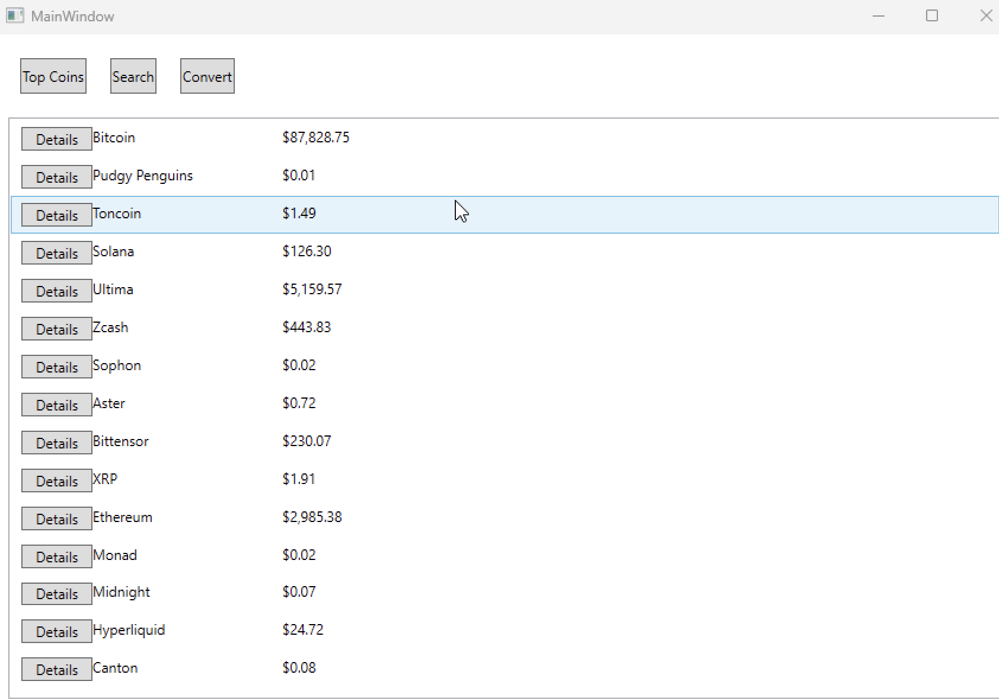
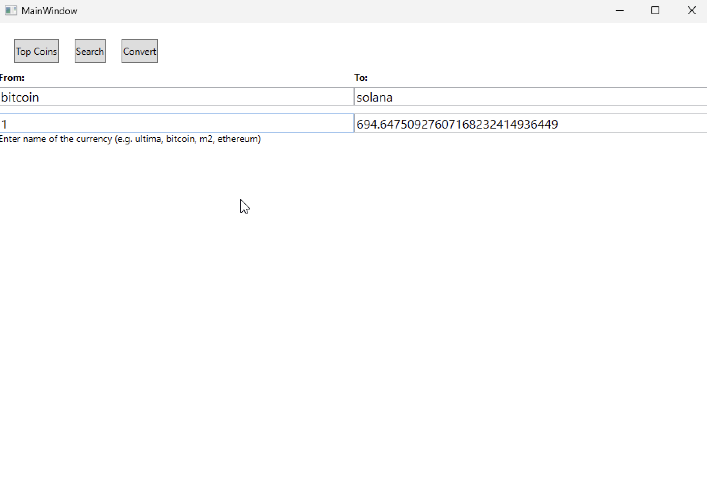
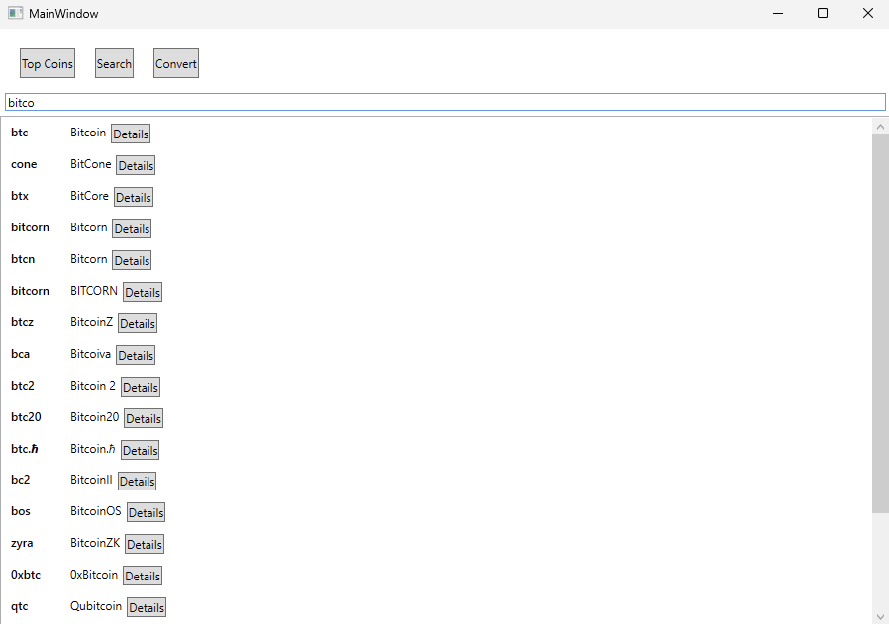

# Cryptocurrency Dashboard
A multi-page desktop application for viewing and analyzing cryptocurrency market data.
Built using .NET (WPF) with MVVM architecture and public crypto APIs.

## Features

* Multi-page application with navigation.
* Main page showing top N cryptocurrencies returned from API
* Page with the ability to view detailed information about the currency:
	* 	Price
	* 	Volume
	* 	Price change
	* 	Markets where it can be purchased and at what price
 	*   ***Ability to go to the currency page on the market***
 * Searching Page by name
 * Usage of MVVM

# Additional features  
* Displaying quote charts for currencies 
* Page on which you can convert one currency to another

## Build & Run
To experience all functionalities, it is mandatory to add your own API Key  

`git clone https://github.com/oppalamarchuk/CryproApp.git`  
`cd CryproApp`  
`dotnet build`  
`dotnet run`  

### API Key Configuration
`dotnet user-secrets init`  
`dotnet user-secrets set "ApiKeys:CoinGecko" "<your_api_key_here>"`

## Screenshots

### Main Page

### Currency Details

### Converter Page

### Search Page

